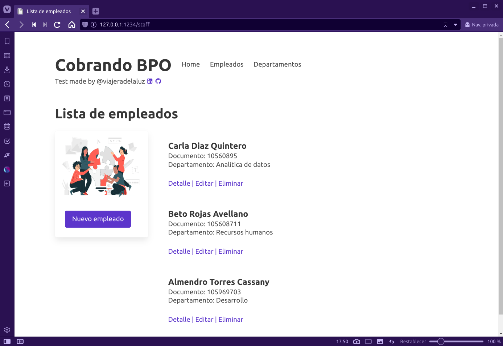

# Cobrando BPO Test

## Overview

This is and example that solves the technical test for the position of Python Developer at [Cobrando BPO](https://www.cobrando.com.co). The functionality of the application includes:

- Create a microservice for the following tables that allows to create, read, update and delete records:
  - table `empleado`:
    - `codigo` (PK, int)
    - `nit` (varchar, 9)
    - `nombre` (varchar, 100)
    - `apellido1` (varchar, 100)
    - `apellido2` (varchar, 100)
    - `codigo_departamento` (FK, int)
  - table `departamento`:
    - `codigo` (PK, int)
    - `nombre` (varchar, 100)
    - `presupuesto` (double)
- The microservice must be developed in Python using the Django framework.
- The microservice must use a PostgreSQL database.
- The microservice must be deployed in a Docker container.
- The microservice must run on port 1234.

## Requirements

To run this application you need to have installed:

- [Docker Engine](https://docs.docker.com/install/) and [Docker Compose](https://docs.docker.com/compose/install/)

## Running the application with Docker

### Building the Docker image

Before runing the docker container it is necessary to build the image:

- Go to the root directory of the project and run the following command:

```bash
~/cobrando$ docker build -t cobrando .
```

- If everything goes well, you will see three messages like these at the end of the building:

```bash
 ---> 85d4daa7f3ee
Successfully built 90b59faeef10
Successfully tagged cobrando:latest
~/cobrando$
```

### Loading the data into the PostgreSQL database

- Run the Docker container:

```bash
~/cobrando$ docker-compose up -d
```

You will see the the messege that the two containers are running:

```bash
[+] Running 2/2
 ⠿ Container cobrando-db-1      Started             0.4s
 ⠿ Container cobrando-backend-1 Started             0.9s
~/cobrando$
```

To confirm that everything is working correctly, go to [http://127.0.0.1:1234/](http://127.0.0.1:1234/) in your browser. You should see the Cobrando BPO Test page.


Before starting to use the application, it is necessary to load the data into the PostgreSQL database. To do this, run the following commands:

- Apply the migrations:

```bash
~/cobrando$ docker exec cobrando-backend-1 python manage.py migrate
Operations to perform:
  Apply all migrations: admin, auth, contenttypes, sessions, staff
Running migrations:
  Applying contenttypes.0001_initial... OK
  Applying auth.0001_initial... OK
  Applying admin.0001_initial... OK
  ...
```

- Load the data:

```bash
~/cobrando$ docker exec cobrando-backend-1 python manage.py loaddata data.json
Installed 47 object(s) from 1 fixture(s)
```

- That's it! Now you can start using the application.



## Technical details

- Application developed in Python 3.10 using the Django framework.
- Uses PostgreSQL as database, data is loaded from a JSON file.
- Uses Docker to run the application, it keeps the data persistent with a Docker volume.
- Uses [Bulma](https://bulma.io) as CSS framework.
- Handels environment variables using `django-environ`.

## Author

Made with 💟 by...

| [<br><sub>Johanna Alfonso<br><sup>@viajeradelaluz](https://github.com/viajeradelaluz) |
| :--------------------------------------------------------------------------------------------------------------------------------------------------------------------------------------: |
